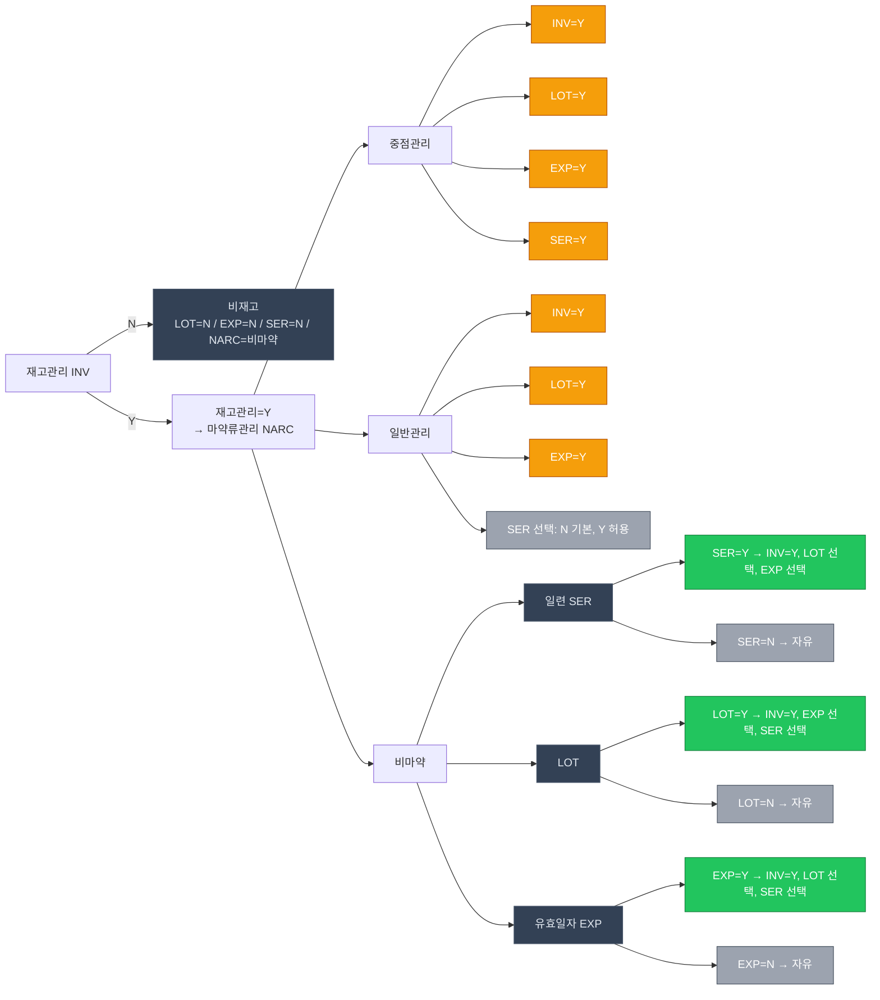

```mermaid
flowchart LR
    %% 색상 정의
    classDef lock fill:#f59e0b,color:#fff,stroke:#b45309;
    classDef auto fill:#22c55e,color:#fff,stroke:#15803d;
    classDef free fill:#9ca3af,color:#fff,stroke:#4b5563;
    classDef neutral fill:#334155,color:#e2e8f0,stroke:#475569;

    %% 1️⃣ 재고관리
    A[재고관리 INV]
    B[비재고<br>LOT=N / EXP=N / SER=N / NARC=비마약]:::neutral
    C[재고관리=Y<br>→ 마약류관리 NARC]

    A -->|N| B
    A -->|Y| C

    %% 2️⃣ 중점관리
    C --> D[중점관리]
    D1[INV=Y]:::lock
    D2[LOT=Y]:::lock
    D3[EXP=Y]:::lock
    D4[SER=Y]:::lock
    D --> D1 & D2 & D3 & D4

    %% 3️⃣ 일반관리
    C --> E[일반관리]
    E1[INV=Y]:::lock
    E2[LOT=Y]:::lock
    E3[EXP=Y]:::lock
    E4[SER 선택: N 기본, Y 허용]:::free
    E --> E1 & E2 & E3 & E4

    %% 4️⃣ 비마약
    C --> F[비마약]

    F1[일련 SER]:::neutral
    F2[LOT]:::neutral
    F3[유효일자 EXP]:::neutral
    F --> F1 & F2 & F3

    F1a[SER=Y → INV=Y, LOT 선택, EXP 선택]:::auto
    F1b[SER=N → 자유]:::free
    F1 --> F1a & F1b

    F2a[LOT=Y → INV=Y, EXP 선택, SER 선택]:::auto
    F2b[LOT=N → 자유]:::free
    F2 --> F2a & F2b

    F3a[EXP=Y → INV=Y, LOT 선택, SER 선택]:::auto
    F3b[EXP=N → 자유]:::free
    F3 --> F3a & F3b

```
